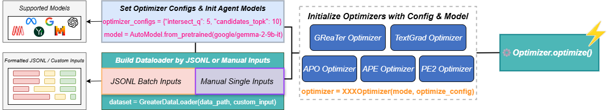

# GReaTer

[](https://arxiv.org/abs/2412.09722)
[](https://colab.research.google.com/drive/1yUPWSG6DuFFD0VIcbCTFdYpxrdT0-Z-f?usp=sharing)

> **GReaTer: Gradients over Reasoning Makes Smaller Language Models Strong Prompt Optimizers**

> Sarkar Snigdha Sarathi Das, Ryo Kamoi, Bo Pang, Yusen Zhang, Caiming Xiong, Rui Zhang

## Overview



Three key components of GReaTer are the following:

- The language model fLLM generates token candidates by conditioning on input samples.
- fLLM uses task input and current prompt to generate reasoning and extract final answer logits.
- The logits are used to calculate loss and compute gradient over generated reasoning with respect to the candidate tokens. These gradients determine the selection of candidate token to update the current position of the current prompt.

## Installation

Not implemented yet. Don't really do the following. Refer to [example.py](./example.py) to learn how to use for now.

```bash
pip install GReaTer
```

## Usage

1. create an input dataset for optimization

    ```python
    from GReaTer import GreaterDataSet

    # There are two ways to create a dataset
    # 1. Load a pre-defined dataset from a json file
    dataset1 = GreaterDataSet(data_path="./data/boolean_expressions.jsonl")

    # 2. Create a dataset from scratch
    # custom_inputs is a list of dictionaries, each dictionary is suppposed to contain a question, a prompt, and an answer
    dataset2 = GreaterDataSet(custom_inputs=[
        {
            "question": "((-1 + 2 + 9 * 5) - (-2 + -4 + -4 * -7)) =", 
            "prompt": "Use logical reasoning and think step by step.", 
            "answer": "24"
        },
        {
            "question": "((-9 * -5 - 6 + -2) - (-8 - -6 * -3 * 1)) =",
            "prompt": "Use logical reasoning and think step by step.",
            "answer": "63"
        },
        {
            "question": "((3 * -3 * 6 + -5) - (-2 + -7 - 7 - -7)) =",
            "prompt": "Use logical reasoning and think step by step.",
            "answer": "-50"
        }
    ])
    ```

2. define the optimize config, for details please refer to the our [documentation page](https://www.google.com/)

    ```python
    # optimizer config
    optimize_config = {
        "intersection": False,
        "candidates_topk": 3,
        "generate_config": {
            "do_sample": False
        }
    }
    T = 105
    ```

3. load the model and tokenizer to initialize the optimizer

    ```python
    # So far we support Llama-3.1 Gemma-2 family models
    # You could use transformers to load the model and tokenizer
    from transformers import LlamaForCausalLM, LlamaTokenizer

    model = LlamaForCausalLM.from_pretrained("meta-llama/Llama-3.1-8B-Instruct")
    tokenizer = LlamaTokenizer.from_pretrained("meta-llama/Llama-3.1-8B-Instruct")

    # initialize the optimizer with the model, tokenizer, and optimize config
    optimizer = GreaterOptimizer(
        model=model, tokenizer=tokenizer, optimize_config=optimize_config
    )
    ```

4. optimize the prompt

    ```python
    # optimize the prompt, optimizer will return a list of optimized prompts and some meta information(e.g. id, question, initial prompt)
    p_stars, meta_info = optimizer.optimize(
        inputs=dataset1, 
        # extractor will be applied to all prompts inside the input dataset
        extractor="Only return the exact answer. \
                Therefore, the final answer (use exact format: '$ True' or '$ False') is $ ",
        rounds=T
    )
    ```

## Citation

```plaintext
@article{das2024greater,
  title={GReaTer: Gradients over Reasoning Makes Smaller Language Models Strong Prompt Optimizers},
  author={Das, Sarkar Snigdha Sarathi and Kamoi, Ryo and Pang, Bo and Zhang, Yusen and Xiong, Caiming and Zhang, Rui},
  journal={arXiv preprint arXiv:2412.09722},
  year={2024}
}
```
